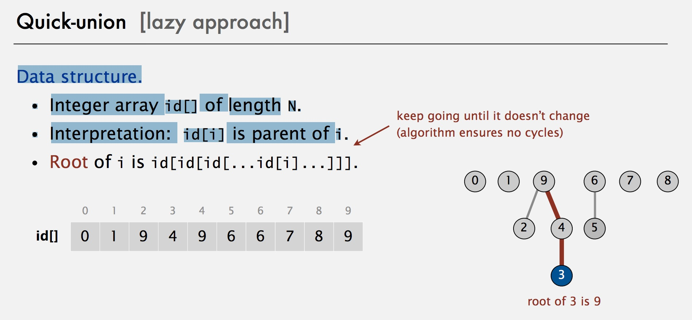
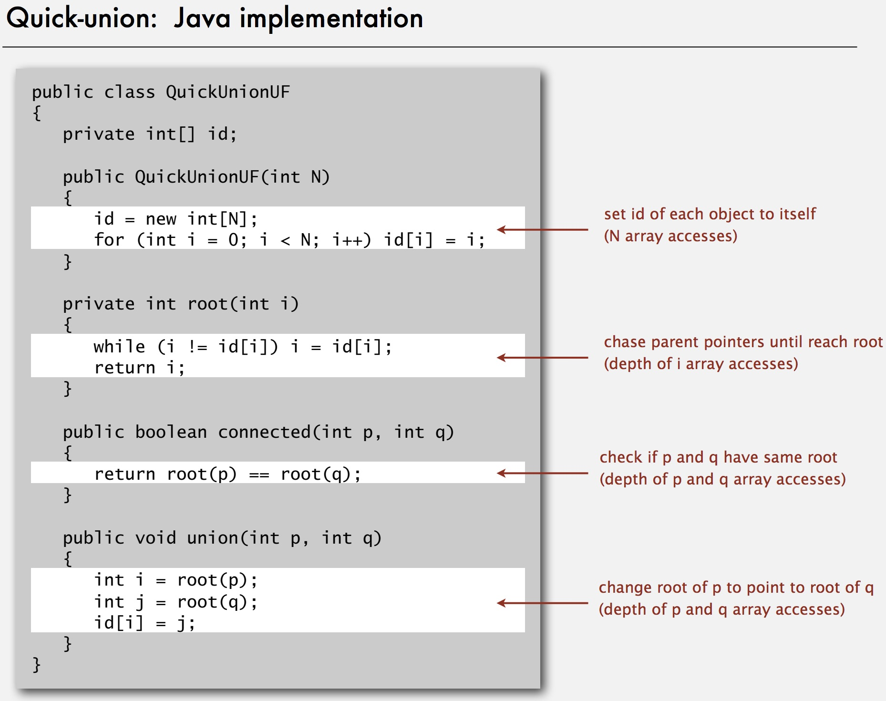
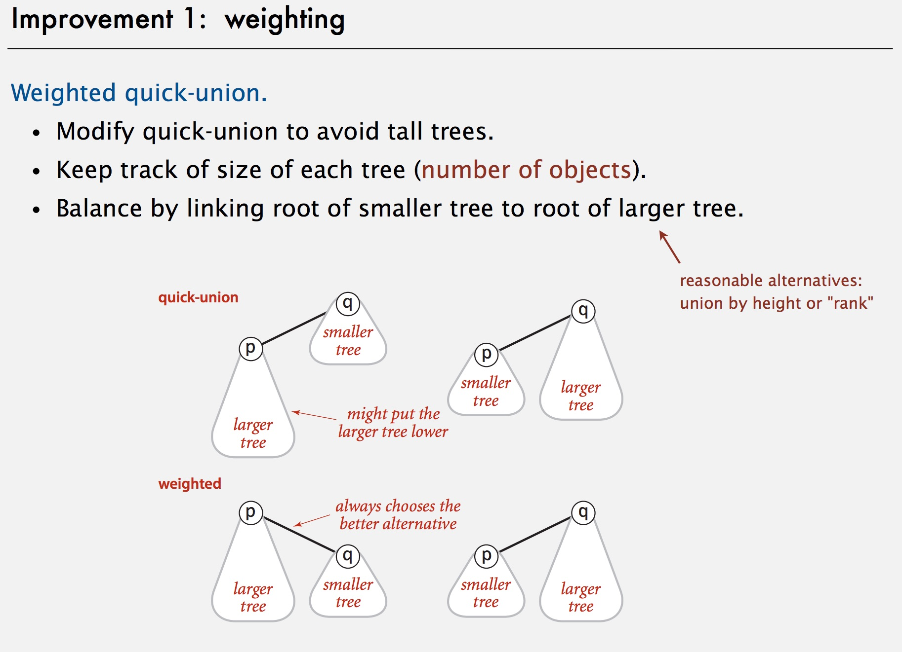
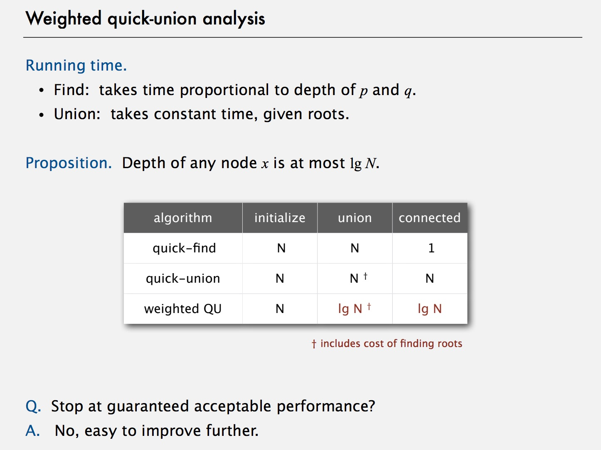

# Union Find

## Dynamic Connectivity
Given a set of N objects.
- Union command: connect two objects.
- Find/connected query: is there a path connecting the two objects?

### Quick Union
Data structure.
- Integer array id[] of length N.
- Interpretation: id[i] is parent of i.

*Problem*: Tree's can become really long making the find operation `linear`.

### Weighted Quick Union

***Improvement:***
*Quick union with path compression.* Just after computing the root of p,
set the id of each examined node to point to that root.

*Complexity:* N * M log (star) N

*log star:* is the number of times the logarithm function must be iteratively applied before the result is less than or equal to 1.
